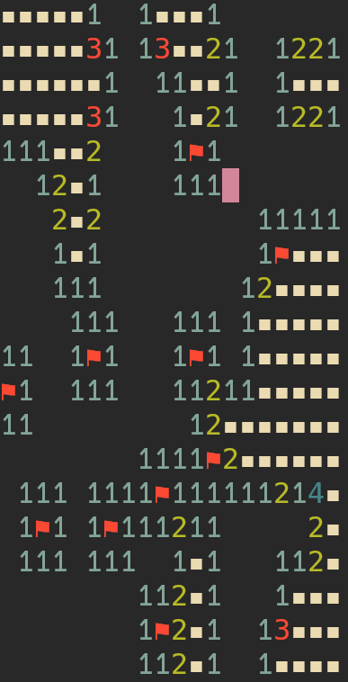
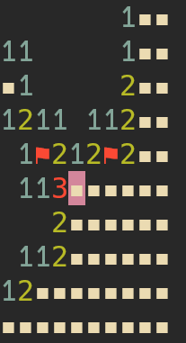

# Minesweeper

Console based minesweeper built in Rust using [crossterm](https://crates.io/crates/crossterm)
## Table of Contents

- [Images](#images)
- [Installation](#installation)
- [Usage](#usage)
- [How to Play](<How to Play>)

## Images





## Installation

### Executable

Download the [latest release](https://github.com/2C0BB/minesweeper/releases/latest)

### Repository

Clone to your project directory and build with cargo

```sh
git clone https://github.com/2C0BB/minesweeper.git
cargo build --release
```

## Usage

Run the executable, board size and amount of mines can be changed with command line args

```sh
./minesweeper <board size> <num of mines>
```

## How to Play

### Controls
- D: dig
- F: flag
- Arrow Keys: Movement

Dig any spot to start, digging a square will reveal if it is a mine or not. If it isn't a mine it shows a count of how many neighbouring mines there are

If there are no neighbouring mines it will automatically dig all of them

If you dig a numbered tile that is already opened and it has that number of neighbouring tiles already flagged it will automatically dig the rest

When all non-mines have been dug you win! If you dig a mine you lose
